[![Discourse Topics][discourse-shield]][discourse-url]
[![Issues][issues-shield]][issues-url]
[![Latest Releases][release-shield]][release-url]
[![Contributor Shield][contributor-shield]][contributors-url]

[discourse-shield]:https://img.shields.io/discourse/topics?label=Discuss%20This%20Tool&server=https%3A%2F%2Fdeveloper.sailpoint.com%2Fdiscuss
[discourse-url]:https://developer.sailpoint.com/discuss/tag/workflows
[issues-shield]:https://img.shields.io/github/issues/sailpoint-oss/repo-template?label=Issues
[issues-url]:https://github.com/sailpoint-oss/repo-template/issues
[release-shield]: https://img.shields.io/github/v/release/sailpoint-oss/repo-template?label=Current%20Release
[release-url]:https://github.com/sailpoint-oss/repo-template/releases
[contributor-shield]:https://img.shields.io/github/contributors/sailpoint-oss/repo-template?label=Contributors
[contributors-url]:https://github.com/sailpoint-oss/repo-template/graphs/contributors

# Identity Fusion
[Explore the docs »](https://developer.sailpoint.com/discuss/t/identity-fusion-saas-connector/38746/3)

[New to the CoLab? Click here »](https://developer.sailpoint.com/discuss/t/about-the-sailpoint-developer-community-colab/11230)

## Introduction
This is a concept custom SaaS connector with two main goals in mind:

- Creating unique identifiers for identities

- Helping with the deduplication process of identities from multiple sources

These two items are a recurring theme in POCs and of special importance in particular contexts. like education.

ISC doesn’t have a built-in mechanism to generate unique identifiers based on a template with value collision handling. There is an account attribute rule that does this but it’s not applicable to identities. In combination with transforms, this has been traditionally used to generate such unique identifiers by provisioning an account to a transactional target system, like a database. This approach, while valid, requires an external system to maintain. Also, creating the initial value is often a cumbersome process that involves deeply nested transforms to normalize strings, remove spaces, trim values, change case, etc.

This connector aims to simplify that by adding the typical string manipulation options readily available as configuration options. The identifier template is based on Velocity for flexibility and standardization, including the placement of the disambiguation counter.

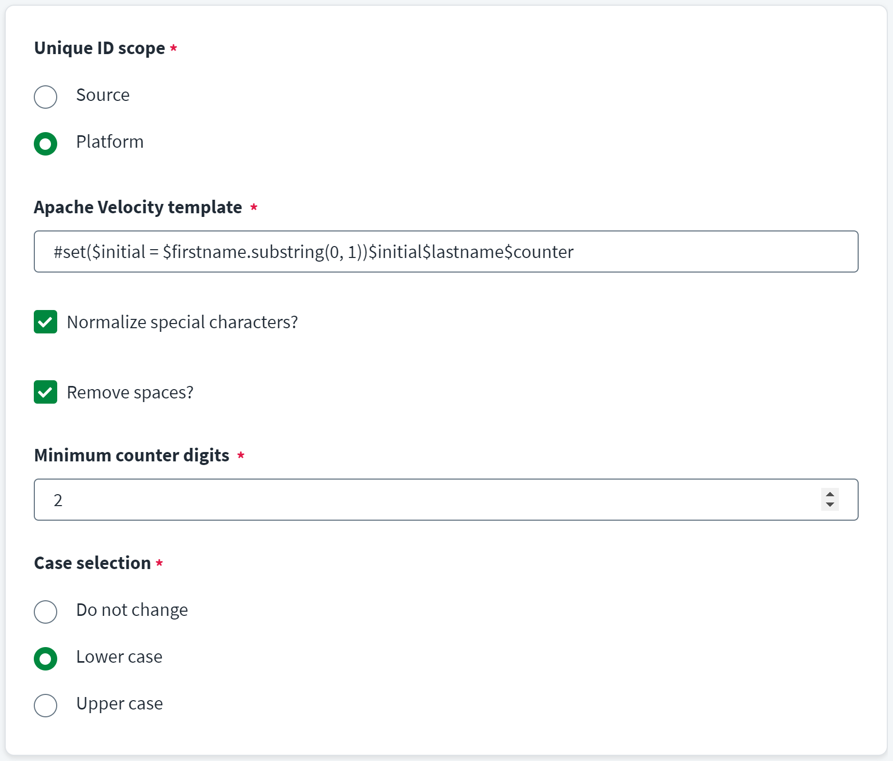

In addition to the template-based unique identifier, the connector assigns an immutable UUID to the account. This identifier can be synchronised to all identity’s accounts, like deduplicated accounts, in order to identify them as part of the same identity. Also, it supports the re-evaluation process of the template-based unique identifier, which could be needed when unfrequent changes happen, like a surname change, that makes the previous value unsuitable.

Another frequent challenge is the deduplication of identities. When identity data comes from multiple sources, chances are data is not 100% accurate and our typical correlation process, based on an identical match on various attributes, could fail and generate duplicated identities. This is very problematic and it requires manual intervention for manual correlation or identity data correction, when possible. The connector helps with this process by submitting new accounts to a manual review based on a similarity check. If the account is considered similar to one or more identities, a form is sent to the configured reviewers. They can decide whether it’s a new identity or it’s part of a similar identity. Other accounts are simply processed and generate a new identity, since there was no match and the connector’s source is authoritative. As an added bonus, conventional correlation can still be used from the original account sources, which makes the process very flexible.

Both features can be used hand by hand or separately. Unique identifier generation can be used without deduplication, as an authoritative source or not. When using deduplication, the connector’s source must be configured as an authoritative source as it needs to control the inflow of accounts. The connector generates proxy accounts which are the result of merging accounts from multiple sources. Since sources may present different account schemas, the connector can discover the account schema as the result of combining the configured sources' schemas. Account merging configuration controls how account attributes map to identity attributes, for comparison, and how to deal with accounts contributing to the same attribute.

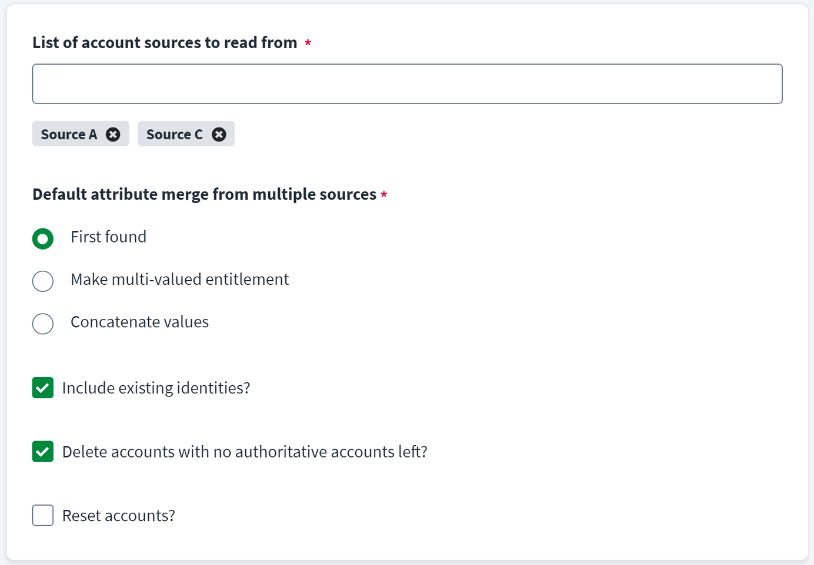

In the process of checking identity duplicates, account data merging and normalization must happen. First off, we’re comparing new accounts to existing identities, so we need to map which account attributes map to which identity attributes. This results in having a combined schema from all configured sources in addition to  a series of normalised attributes. When multiple source accounts contribute to a proxy account, multiple values for the same attribute may be present. The connector allows to keep all values or just one. Keeping all values for an attribute greatly helps in use cases where multiple accounts can contribute to an identity attribute, like multiple job descriptions for the same person, that can be used for role assignments or searches.

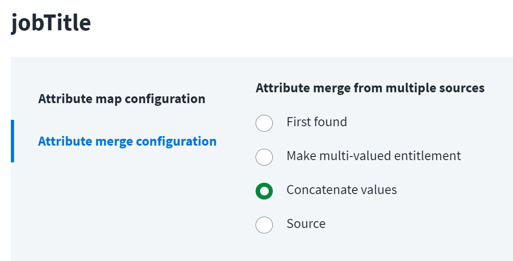

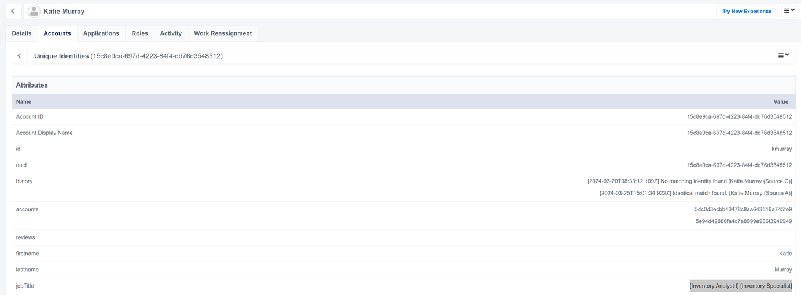

## How does the connector work?
The connector can be configured in two different modes:

- **Authoritative source**: in order to use deduplication, the connector must be configured as an authoritative source. The source is configured to read from a list of sources that, in other circumstances, would be configured as authoritative sources themselves. The connector creates proxy accounts as a result of the merging process so original accounts are not really needed to build the identity profile. Proxy accounts provide all account attribute data directly.

- **Regular source**: when only generation of unique identifiers is needed, the connector can be configured as a regular source and the identifiers used on those identity profiles linked to sources included in the configuration. When using this mode, it’s necessary to ensure that:

 - All sources for the identity profiles we want to generate unique identifiers for are included in the list.

 - Include existing identities is enabled.

 - Unique ID scope is set to source.

 - The attributes used in the Velocity template exist in the account schema or they’re a mapped identity attribute.

In both cases, proxy accounts are generated based on sources configured and other configuration options. Proxy accounts are simply the result of putting together all source accounts attributes, normalised attributes as per configuration and a set of mandatory attributes as described below:

- **id**: template-based unique ID.

- **uuid**: immutable UUID.

- **accounts**: list of source accounts IDs linked to the account.

- **history**: chronological history of the operations performed on the account.

- **status**: list of entitlements used as tags to identify the origin of the account.

- **reviews**: list of pending form instances a reviewer must attend to.

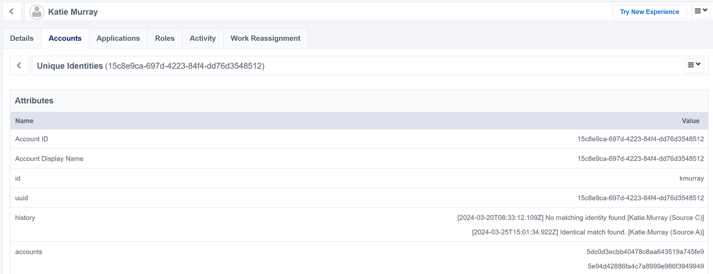

The connector main processing happens on account aggregation. The aggregation context prevents having race conditions when creating the identifiers. The connector reads previously aggregated accounts and compares the current list to the existing source accounts to detect accounts not processed yet. It is also important to note that each run starts by processing completed form instances generated by previous runs, since these decisions may create a new account or update an existing one. On each run, proxy accounts are updated with deduplication actions data and new source account data.

When a potential match is found, based on an attribute similarity check, the connector generates form instances for reviewers to check. The first reviewer to complete the form decides what to do with that account: create a new one or link it to an existing identity.

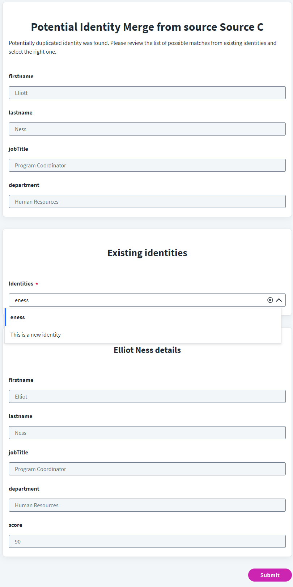

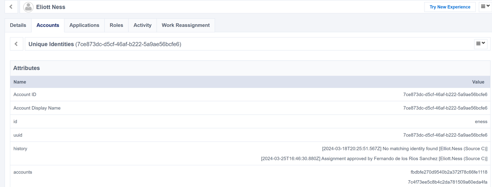

When running account aggregation for the first time, an account baseline must be created. This doesn’t affect the creation of unique identifiers, which are always unique regardless of the batch they were created on. However, for deduplication, we must have a set of identities to compare to. That’s the baseline, and it’s meant to be created out of a curated list of accounts. More sources can be later added to the configuration and they’ll be compared to that baseline.

Newly created proxy accounts are returned as disabled. This is intentional and somewhat necessary if we want them to be quickly correlated to the source account. The reason is that when configured in authoritative source mode, a new account creates a new identity. Since the identity does not exist yet, it cannot be correlated to the source account. One should configure the identity profile so it automatically enables proxy accounts, which triggers such correlation. Alternatively, the next account aggregation will run pending account correlations.

Account disable triggers template-based unique identifier re-evaluation. The account can be then re-enabled or re-aggregated so it appears enabled, but it’s not really important. Note UUID must be configured as account native identity and name to allow for this change. Native identity cannot be changed so UUID is perfectly fine for that. Account name must not change if we want to keep the identity, therefore UUID is also a good fit.

Entitlement aggregation just populates all different statuses with descriptions.

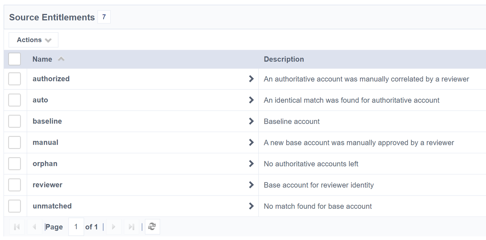

The connector supports discovering the schema. The schema is built by merging the configured sources’s schemas, normalised attributes as per configuration and some predefined attributes. Depending on the attribute merge configuration, some attributes may be returned as multi-valued entitlements. When changing attribute merge settings that may result in multi-valued attributes changes after the first discovery, please review your schema and change it accordingly, since ISC doesn’t. It’s also worth noting that optional schema attributes can be removed to prevent undesired data to be fetched.

### Configuration options

- **IdentityNow API URL**: API url of the current tenant, for loopback connection.

- **Personal Access Token ID**: Personal Access Token ID with scopes:all scope.

- **Personal Access Token secret**: Personal Access Token secret.

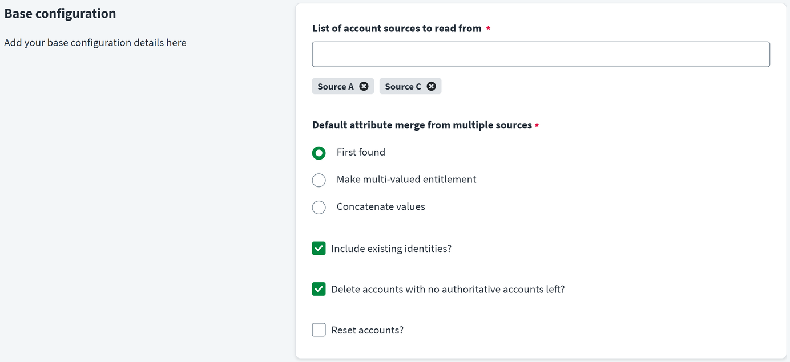

- **List of account sources to read from**: list of authoritative sources to read from.

- **Default attribute merge from multiple sources**

 - **First found**: use first value found for account, based on the source order set above, to populate attribute.

 - **Make multi-valued entitlement**: create a list of unique values from all accounts contributing to the attribute.

 - **Concatenate values**: create a concatenated string of unique values, enclosed in square brackets, from all accounts contributing to the attribute.

- **Include existing identities?**: whether to include existing identities from the source list. When not included, correlated accounts from the source list are ignored. When included, they’re processed too but the identity’s uid is considered its unique ID.

- **Delete accounts with no authoritative accounts left?**: whether to delete the proxy account when there are no linked accounts left.

- **Reset accounts?**: convenience option to reset current accounts from the source.

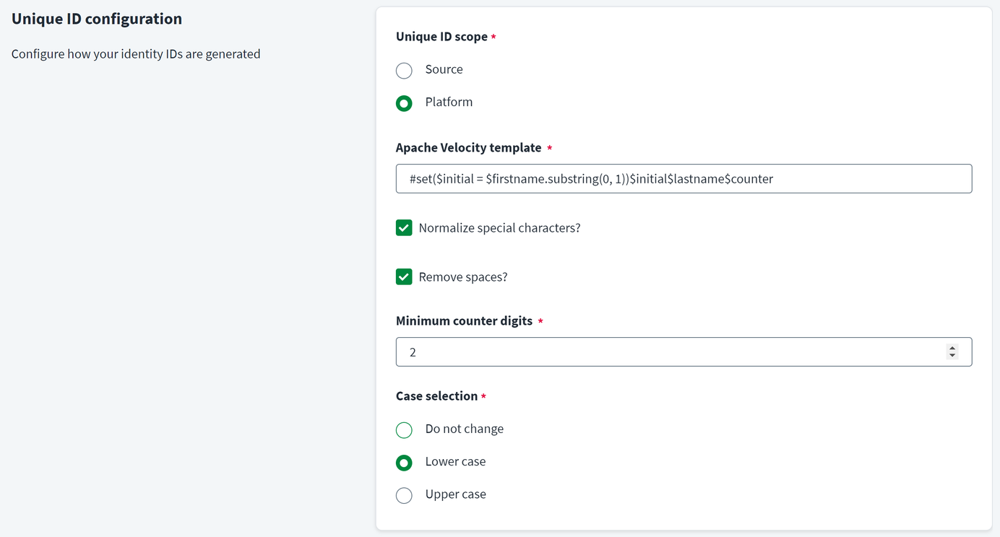

- **Unique ID scope**

 - **Source**: only consider source accounts when calculating unique identifiers.

 - **Platform**: consider both source accounts IDs and all identities UIDs when calculating unique identifiers.

- **Apache Velocity template**: template to generate unique identifiers. Apache Velocity context is based on the account attributes. It is best to use normalised attributes, defined in the next section.

- **Normalize special characters?**: remove special characters and quotes.

- **Maximum counter digits**: zero-based padding added to disambiguation counter.

- **Case selection**

 - **Do not change**: do nothing.

 - **Lower case**: change string to lower case.

 - **Upper case**: change string to upper case.

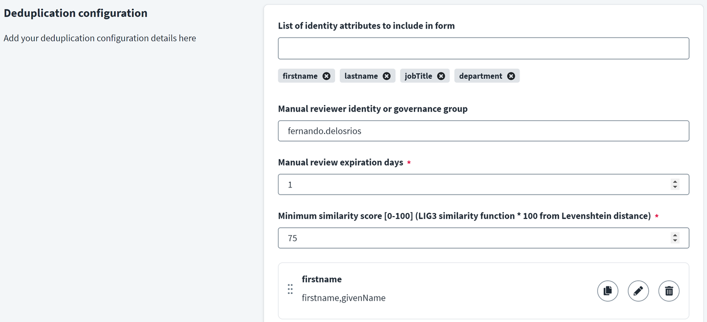

- **List of identity attributes to include in form**: list of identity attributes to include in form.

- **Manual reviewer identity or governance group**: UID of reviewer or governance group name.

- **Manual review expiration days**: number of days after the form instance expires.

- **Minimum similarity score [0-100] (LIG3 similarity function * 100 from Levenshtein distance)**: similarity score to apply attribute by attribute configured below. 0 is totally different and 100 is exactly the same. More information here.

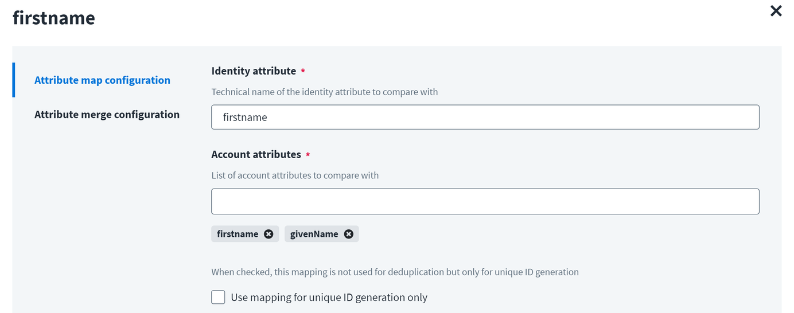

- **Identity attribute**: identity attribute to compare to. This attribute is also added to the proxy account schema and populated by the contents from the account attributes below.

- **Account attributes**: account attributes to compare to the identity attribute above.

- **Use mapping for unique ID generation only**: when checked, account attribute mapping occurs but this configuration is not used form similarity matching.

- **First found**: use first value found for account, based on the source order set above, to populate attribute.

- **Make multi-valued entitlement**: create a list of unique values from all accounts contributing to the attribute.

- **Concatenate values**: create a concatenated string of unique values, enclosed in square brackets, from all accounts contributing to the attribute.

- **Source**: name of the only source contributing to this attribute.

### Correlation

Correlation configuration depends on the situation:

- *Authoritative source*: reviewer accounts always get the identity’s UID as unique identifier. Therefore, when using deduplication, correlation from identity’s UID to account’s id must be set.

- *Regular source*: in order for the proxy accounts to directly correlate to the corresponding identities, we need to identify those account attributes we can match with identity attributes. This configuration depends on the actual data and it’s no different to any other source account correlation.

### Account aggregation process diagram

<iframe width="768" height="432" src="https://miro.com/app/live-embed/uXjVNgEpRGs=/?moveToViewport=-908,-508,1953,1254&embedId=143980806927" frameborder="0" scrolling="no" allow="fullscreen; clipboard-read; clipboard-write" allowfullscreen></iframe>

<!-- CONTRIBUTING -->
## Contributing

Contributions are what make the open source community such an amazing place to learn, inspire, and create. Any contributions you make are **greatly appreciated**.

If you have a suggestion that would make this better, please fork the repo and create a pull request. You can also simply open an issue with the tag `enhancement`.
Don't forget to give the project a star! Thanks again!

1. Fork the Project
2. Create your Feature Branch (`git checkout -b feature/AmazingFeature`)
3. Commit your Changes (`git commit -m 'Add some AmazingFeature'`)
4. Push to the Branch (`git push origin feature/AmazingFeature`)
5. Open a Pull Request

<!-- LICENSE -->
## License

Distributed under the MIT License. See `LICENSE.txt` for more information.

<!-- CONTACT -->
## Discuss
[Click Here](https://developer.sailpoint.com/dicuss/tag/{tagName}) to discuss this tool with other users.
